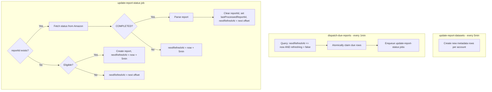

# Report State Machine

## Overview

The report state machine manages the lifecycle of Amazon Ads reports, from creation through processing. It ensures reports are created at appropriate intervals, polled for completion, and processed efficiently.

## Key Database Columns

The `reportDatasetMetadata` table tracks the state of each report dataset:

- **`reportId`**: The current Amazon Ads report ID (null after processing)
- **`lastProcessedReportId`**: The most recently processed report ID (for debugging)
- **`status`**: Current status (`missing`, `fetching`, `parsing`, `completed`, `error`)
- **`refreshing`**: Whether a refresh is currently in progress (prevents concurrent processing)
- **`nextRefreshAt`**: When this record should be checked next (drives polling)
- **`lastReportCreatedAt`**: When the last report was created (used for eligibility calculations)
- **`periodStart`**: The UTC instant for the account-local report date's midnight
- **`aggregation`**: Report type (`hourly` or `daily`)
- **`entityType`**: Entity type (`target` or `product`)

## Scheduled Job and Polling

The scheduler uses two intentionally separate jobs:

1. **`update-report-datasets` every 5 minutes** creates and cleans up metadata rows within each report retention window (via `update-report-dataset-for-account`).
2. **`dispatch-due-reports` every minute** only queries `nextRefreshAt <= now AND refreshing = false`, atomically claims rows, and enqueues `update-report-status`. In-flight reports go first; new reports are newest-first and limited to one in progress per account so report creation cannot build a queue behind Amazon's endpoint-wide cooldown.

This polling mechanism ensures:
- Due work begins within about one minute; pending Amazon reports are checked every ~5 minutes until they complete
- Completed reports wait until the next eligibility offset before creating a new report
- Only records that are actually due get processed (efficient)

## State Machine Logic

The `getNextAction` function determines what action to take:

1. **If `reportId` exists**: Fetch status from Amazon Ads API
   - If `COMPLETED` → return `'process'`
   - If Amazon marks it failed or cancelled → return `'fail'`, clear the dead report ID, and advance to the next reconciliation milestone
   - If still pending → return `'none'` (wait)
2. **If no `reportId`**: Check eligibility
   - If eligible → return `'create'`
   - If not eligible → return `'none'`

## Actions and Transitions

### `'create'` Action

- Creates a new report via Amazon Ads API
- Sets `reportId`, `status = 'fetching'`, `lastReportCreatedAt`
- Sets `nextRefreshAt = now + 5 minutes` (poll for completion)

### `'process'` Action

- Sets `status = 'parsing'`
- Downloads and parses the report data
- Sets `status = 'completed'`
- Clears `reportId`, sets `lastProcessedReportId` to the old `reportId`
- Recalculates `nextRefreshAt` to the next eligibility offset

### `'none'` Action

- If report is pending (reportId exists but not completed): Sets `nextRefreshAt = now + 5 minutes` (poll again soon)
- If not eligible: Sets `nextRefreshAt` to the next eligibility offset

## Refresh Milestones

Reports are eligible for refresh at specific time offsets after the dataset timestamp:

- **Daily reports**: local-calendar T+1, T+3, T+5, T+7, T+14, T+30, T+60 days
- **Hourly-grain reports**: every 3 hours during the first day after the local date closes, then local-calendar T+3 days, T+7 days, and T+13 days 21 hours

All milestones are constructed in the account timezone and stored as UTC instants. They therefore remain on the intended local clock across daylight-saving transitions.

A report is eligible if:
1. The age (NOW - timestamp) has reached or exceeded one of the eligible offsets
2. No report was already created at that offset (based on `lastReportCreatedAt`)

## Flow Diagram

```mermaid
flowchart TD
    subgraph maintenanceJob [update-report-datasets - every 5min]
        CreateRows[Create new metadata rows per account]
    end
    subgraph dispatchJob [dispatch-due-reports - every 1min]
        QueryDue["Query: nextRefreshAt <= now AND refreshing = false"]
        Claim[Atomically claim due rows]
        EnqueueStatus[Enqueue update-report-status jobs]
        QueryDue --> Claim --> EnqueueStatus
    end
    
    subgraph stateMachine [update-report-status job]
        CheckReportId{reportId exists?}
        FetchAmazon[Fetch status from Amazon]
        CheckCompleted{COMPLETED?}
        Process[Parse report]
        ClearId["Clear reportId, set lastProcessedReportId, nextRefreshAt = next offset"]
        StillPending["nextRefreshAt = now + 5min"]
        CheckEligible{Eligible?}
        CreateReport["Create report, nextRefreshAt = now + 5min"]
        NotEligible["nextRefreshAt = next offset"]
        
        CheckReportId -->|Yes| FetchAmazon
        CheckReportId -->|No| CheckEligible
        FetchAmazon --> CheckCompleted
        CheckCompleted -->|Yes| Process --> ClearId
        CheckCompleted -->|No| StillPending
        CheckEligible -->|Yes| CreateReport
        CheckEligible -->|No| NotEligible
    end
```

## Key Design Decisions

1. **`reportId` is cleared after processing**: Prevents reprocessing the same report. The state machine checks eligibility for a new report instead.

2. **`nextRefreshAt` drives polling**: Instead of polling all records, we only check records where `nextRefreshAt <= now`. This is efficient and scales well.

3. **Short polling interval for pending reports**: When a report is created or still pending, `nextRefreshAt` is set to 5 minutes in the future. This ensures users see data quickly without excessive API calls.

4. **Atomic work claims**: The dispatcher changes `refreshing` from false to true before enqueueing. Manual refresh jobs claim inside `update-report-status`. Duplicate jobs therefore cannot issue duplicate Amazon API calls for the same dataset row.

5. **Eligibility based on creation time**: The `lastReportCreatedAt` timestamp determines eligibility, not when the report was processed. This ensures we don't miss eligibility windows even if processing takes a long time.

6. **Bounded parse diagnostics**: Report processing records counts and up to five distinct error messages with the job event. Raw failed report rows are not retained.
